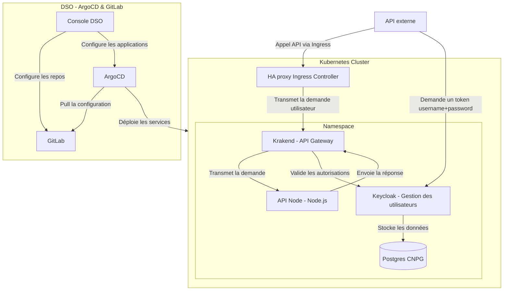
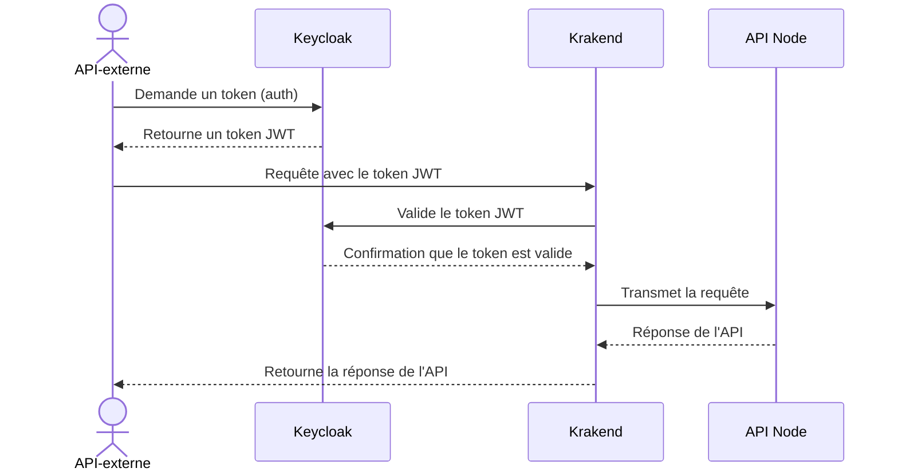

# Présentation du projet

Ce projet propose un déploiement d'application prototype en utilisant Helm. L'application se compose des éléments suivants :
- Une API Node.js
- Keycloak pour la gestion des utilisateurs
- Krakend en tant que passerelle API
- Une base de données PostgreSQL

## Architecture

L'architecture repose sur plusieurs composants, notamment un contrôleur Ingress HAProxy ( résent dans les clusters OpenShift) qui redirige les requêtes vers la passerelle Krakend. Celle-ci vérifie l'authentification et les rôles auprès de Keycloak, avant de transmettre, ou non, la requête vers l'API Node.js. Keycloak gère l'authentification des utilisateurs, tandis que les données sont stockées dans une base de données PostgreSQL CloudNativePG. Le déploiement des services est automatisé via ArgoCD, avec GitLab servant de source de configuration.
La création du contenu dans ARGOCD et Gitlab et effectué par la [Console DSO](https://console.apps.dso.numerique-interieur.com/).

<div style="margin-top: 50px;">



<div style="margin-top: 50px;">

# Diagramme de séquence 
Ce diagramme de séquence illustre le processus d'authentification et de transmission des requêtes entre les différents composants de l'architecture.

Lorsqu'une API externe souhaite accéder à l'application, elle commence par demander un token d'authentification à Keycloak. Keycloak, responsable de la gestion des utilisateurs, génère et renvoie un token JWT à l'API externe. Ce token sert ensuite à authentifier la requête auprès de la passerelle Krakend, qui se charge de valider le token JWT en communiquant à nouveau avec Keycloak.

Une fois l'authentification confirmée, Krakend transmet la requête à l'API Node.js. L'API répond ensuite à Krakend, qui à son tour envoie la réponse finale à l'API externe, clôturant ainsi le cycle de la requête. Ce processus garantit que seules les requêtes authentifiées et autorisées accèdent à l'API.

<div style="margin-top: 50px;">


<div style="margin-top: 50px;">

# Comment installer le prototype
1. Se connecter à la [console](https://console.apps.dso.numerique-interieur.com) Cloud Pi Native
2. Créer un projet
3. Forquez le repo de l'API [ici](https://github.com/cloud-pi-native/prototype-cpin-node)
4. Créer un dépôt nommé `api-node` dans la console, et le faire pointer sur votre fork
5. Vérifiez sur le [GitLab DSO](https://gitlab.apps.dso.numerique-interieur.com) que vos pipelines de mirror et de build sont passés
6. Clonez ce dépôt :
    ```bash
    git clone https://github.com/cloud-pi-native/prototype-cpin.git
    cd prototype-cpin
    ```
7. Poussez ce dépôt sur GitHub ou un autre service
8. Modifiez le fichier `.env` présent dans le répertoire `scripts` avec vos informations. Le fichier est prérempli avec les informations de DSO PROD, pensez à mettre à jour le nom de votre projet ainsi que le nom de l'environnement.
9. Lancez le script présent dans le répertoire `scripts`
    ```bash
    cd scripts
    bash generate_script.sh
    ```
11. Poussez les fichiers générés par le script dans votre dépôt Git
12. Créez un dépôt nommé `minio` dans la console en cochant la case dépôt d'infrastructure et en le faisant pointer vers le dépôt que vous avez créé à l'étape précédente.
13. Créez un environnement avec le même nom que celui que vous avez spécifié dans le fichier `.env`
14. Rendez-vous sur `ArgoCD` à partir de la `console`
15. Modifiez l'application `minio` afin d'utiliser le bon fichier `values` et le bon chemin dans votre repo (cf. docs CPIN)
16. Une fois que `minio` est déployé, effectuez les mêmes opérations sur la `console` et `ArgoCD` pour `postgres` (le dépôt doit s'appeler `postgres` dans la console)
17. Une fois que `postgres` est installé, effectuez les mêmes opérations sur la console et ArgoCD pour l'`API node` (le dépôt doit s'appeler `api-node` dans la console)


## API Node.js
L'API Node.js expose plusieurs endpoints permettant d'effectuer des requêtes :
- GET
- PUT
- POST

Cette api est build via la console CPIN.

## Keycloak
Keycloak est déployé à l'aide du chart Helm Bitnami Keycloak [Voir la documentation](https://github.com/bitnami/charts/tree/main/bitnami/keycloak).\
Le chart Helm de Keycloak est une dépendance, et la fonctionnalité keycloak-config-cli est utilisée pour importer un "realm" configuré dans une ConfigMap (répertoire `keycloak/templates/configmap.yaml`). Un exemple d'implémentation se trouve dans le fichier `values` de Keycloak, où les variables d'environnement (provenant de secrets Kubernetes) sont définies.

## PostgreSQL
CloudNativePG est un opérateur Kubernetes pour la gestion du cycle de vie des clusters PostgreSQL. Ses fonctionnalités clés incluent :

- High availability : Utilisation de la réplication en continu sur des zones différentes.
- Basculement automatique et auto-réparation. (au sein du même cluster)
- Sauvegarde et récupération : Sauvegarde continue et récupération à un instant donné. (Point in Time recovery)
- Observabilité : Intégration avec Prometheus.
- Pattern cloud-native : Configuration en yaml et intégrable dans une CI/CD.
- Sécurité : Connexions TLS et audits logs.
- Mécanisme de réplication distant (bascule manuelle possible entre deux région)
  
La base de données PostgreSQL est déployée à l'aide du chart CloudNativePG [Voir la documentation](https://github.com/cloudnative-pg/charts/tree/main/charts/cluster).\
Le chart Helm de CloudNativePG est une dépendance, et il est utilisé par Keycloak pour le stockage des données utilisateurs. Afin de gérer le cycle de vie de la base de données indépendamment des autres services, elle est maintenue dans un chart distinct de Keycloak, ce qui permet de prévenir les erreurs et d'optimiser la réutilisation des charts Helm.

## Krakend
Pour l'API Gateway, nous utilisons le chart Helm Krakend [Voir la documentation](https://github.com/equinixmetal-helm/krakend/tree/main/), recommandé par Krakend, bien qu'il ne soit pas officiel.\
Dans l'exemple de ce repo, nous implémentons 3 rôles (admin, moderator, user) qui ont accès aux endpoints suivants:
- GET /api/public => endpoint ouvert
- GET /api/users/1 => USER, MODERATOR, ADMIN
- GET /api/users/2 => USER, MODERATOR, ADMIN
- GET /api/users/3 => USER, MODERATOR, ADMIN
- PUT /api/moderator/1 => ADMIN, MODERATOR
- PUT /api/moderator/2 => ADMIN, MODERATOR
- POST /api/admin/1 => ADMIN
- POST /api/admin/2 => ADMIN

L'implémentation de ces droits ce fais ici: 

```yaml
# définition de l'API NODE et de keycloak qui sont rappelé dans le endpoints.tmpl
    settings:
        urls.json: |-
        {
            "APIHost": "http://mi-apimcanel-dev-kaamelott-infra-6293-api",
            "JWKUrl": "http://mi-apimcanel-dev-keycloak-6293/realms/krakend-realm/protocol/openid-connect/certs"
        }
    endpoints.tmpl: |-
# définition du validateur d'accès aux endpoints
      {{ define "auth_validator" }}
      {
        "alg": "RS256",
        "jwk_url": "{{ .JWKUrl }}",
        "disable_jwk_security": true,
        "roles": {{ .Roles }},
        "roles_key": "realm_access.roles",
        "roles_key_is_nested": true,
          "propagate_claims": [
          ["preferred_username", "x-user"],
          ["realm_access.role", "x-role"]
        ]
      }
      {{ end }}
# script LUA permettant de logger qui appelle un endpoint en décodant le header      
      {{ define "lua_prescript" }}
      {
        "pre": "local r = request.load();print('[GATEWAY] Request from username: ' .. r:headers('X-User') .. ' with path: ' .. r:path() .. ' and method: ' .. r:method())",
        "live": false,
        "allow_open_libs": true,
        "skip_next": false
      }
      {{ end }}
      {{$host := .APIHost}}
      {{$JWKUrl := .JWKUrl}}
# définition d'un endpoint avec variable    
        {
          "endpoint": "/api/user/{id}",
          "method": "GET",
          "backend": [
            {
              "host": ["{{ $host }}"],
              "url_pattern": "/user/{id}"
            }
          ],
          "input_headers": {{ include "input_header.txt"}},
          "extra_config": {
            "auth/validator": {{ template "auth_validator" (dict "JWKUrl" $JWKUrl "Roles" "[\"admin\", \"moderator\", \"user\"]") }},
            "modifier/lua-proxy": {{ template "lua_prescript" . }}
          }
        },
        {
          "endpoint": "/api/public",
          "method": "GET",
          "backend": [
            {
              "host": ["{{ $host }}"],
              "url_pattern": "/public"
            }
          ]
        },
        {
            "endpoint": "/api/modo/{id}",
            "method": "PUT",
            "backend": [
              {
                "host": ["{{ $host }}"],
                "url_pattern": "/modo/{id}"
              }
            ],
            "input_headers": {{ include "input_header.txt"}},
            "extra_config": {
              "auth/validator": {{ template "auth_validator" (dict "JWKUrl" $JWKUrl "Roles" "[\"admin\", \"moderator\"]") }},
              "modifier/lua-proxy": {{ template "lua_prescript" . }}
            }
          },
          {
            "endpoint": "/api/admin/{id}",
            "method": "POST",
            "backend": [
              {
                "host": ["{{ $host }}"],
                "url_pattern": "/admin/{id}"
              }
            ],
            "input_headers": {{ include "input_header.txt"}},
            "extra_config": {
              "auth/validator": {{ template "auth_validator" (dict "JWKUrl" $JWKUrl "Roles" "[\"admin\"]") }},
              "modifier/lua-proxy": {{ template "lua_prescript" . }}
            }
          }
```
**Note importante** : \
Les dépendances ne sont pas utilisées pour Krakend, étant donné que le chart spécifie un `SecurityContext` avec `RunAsUser: 1000`. Actuellement, cette valeur ne peut pas être désactivée en raison de l'attente d'intégration de la [PR #12879](https://github.com/helm/helm/pull/12879/) dans Helm.

La [configuration flexible](https://www.krakend.io/docs/configuration/flexible-config/) de Krakend est utilisée pour implémenter les routes de manière plus efficace et concise.

**Pas de wildcard possible**, les wildcards sont disponible sur la version enterprise.

Ce projet a pour destinatin d'être un poc ou pour un petit projet, pour toute nécessité d'API Management, nous vous conseillons de prendre d'autres solutions.

## Gestion des secrets
Afin de gérer les secrets, le script [d'encryption](./encrypt.sh) permet de chiffrer ses SopsSecret avec Sops (cf: [docs](https://cloud-pi-native.fr/guide/secrets-management)).
Le script viens rechercher les fichiers présents dans les dossiers et sous dossiers de ce repo et ayant l'extension `*.dec.yaml`
Le script fonctionne aussi lorsque les .dec.yaml sont dans le .gitignore et ne chiffre pas des fichiers qui n'ont pas été modifié.
// TODO: faire un script de decrypt 

**Note importante** : \
Pensez à mettre vos fichiers décodés dans votre `.gitignore`

## Informations annexes
Les configurations de ressources (ram/cpu) sont données dans ce repo à titre indicatif.\
Il est **indispensable** d'effectuer des tests de charge de son application avant de la déployer en recette ou en production.


---

## Sources et Références :
- [Documentation Krakend](https://www.krakend.io/docs/overview/)
- [Documentation CloudNativePG](https://github.com/cloudnative-pg/charts/tree/main/charts/cluster/)
- [Chart Helm Bitnami Keycloak](https://github.com/bitnami/charts/tree/main/bitnami/keycloak/)
- [Documentation Helm PostgreSQL](https://cloudnative-pg.io/documentation/1.24/)
- [Helm Krakend](https://github.com/equinixmetal-helm/krakend/tree/main/)
- [Pull Request Helm #12879](https://github.com/helm/helm/pull/12879/)
- [Documentation CloudPiNative](https://cloud-pi-native.fr)
