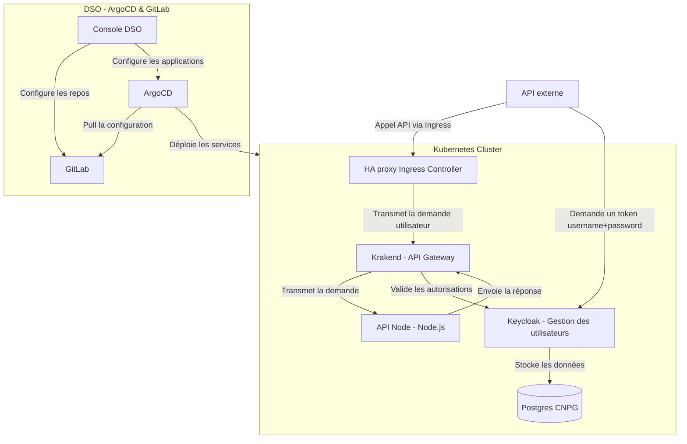

# Présentation du projet

Ce projet propose un déploiement d'application prototype en utilisant Helm. L'application se compose des éléments suivants :
- Une API Node.js
- Keycloak pour la gestion des utilisateurs
- Krakend en tant que passerelle API
- Une base de données PostgreSQL

## Architecture

L'architecture repose sur plusieurs composants, notamment un contrôleur Ingress HAProxy ( résent dans les clusters OpenShift) qui redirige les requêtes vers la passerelle Krakend. Celle-ci vérifie l'authentification et les rôles auprès de Keycloak, avant de transmettre, ou non, la requête vers l'API Node.js. Keycloak gère l'authentification des utilisateurs, tandis que les données sont stockées dans une base de données PostgreSQL CloudNativePG. Le déploiement des services est automatisé via ArgoCD, avec GitLab servant de source de configuration.
La création du contenu dans ARGOCD et Gitlab et effectué par la [Console DSO](https://console.apps.dso.numerique-interieur.com/).

# Diagramme de séquence 
Ce diagramme de séquence illustre le processus d'authentification et de transmission des requêtes entre les différents composants de l'architecture.

Lorsqu'une API externe souhaite accéder à l'application, elle commence par demander un token d'authentification à Keycloak. Keycloak, responsable de la gestion des utilisateurs, génère et renvoie un token JWT à l'API externe. Ce token sert ensuite à authentifier la requête auprès de la passerelle Krakend, qui se charge de valider le token JWT en communiquant à nouveau avec Keycloak.

Une fois l'authentification confirmée, Krakend transmet la requête à l'API Node.js. L'API répond ensuite à Krakend, qui à son tour envoie la réponse finale à l'API externe, clôturant ainsi le cycle de la requête. Ce processus garantit que seules les requêtes authentifiées et autorisées accèdent à l'API.

## API Node.js
L'API Node.js expose plusieurs endpoints permettant d'effectuer des requêtes :
- GET
- PUT
- POST

## Keycloak
Keycloak est déployé à l'aide du chart Helm Bitnami Keycloak [Voir la documentation](https://github.com/bitnami/charts/tree/main/bitnami/keycloak).\
Le chart Helm de Keycloak est une dépendance, et la fonctionnalité keycloak-config-cli est utilisée pour importer un "realm" configuré dans une ConfigMap (répertoire `keycloak/templates/configmap.yaml`). Un exemple d'implémentation se trouve dans le fichier `values` de Keycloak, où les variables d'environnement (provenant de secrets Kubernetes) sont définies.

## PostgreSQL
La base de données PostgreSQL est déployée à l'aide du chart CloudNativePG [Voir la documentation](https://github.com/cloudnative-pg/charts/tree/main/charts/cluster).\
Le chart Helm de CloudNativePG est une dépendance, et il est utilisé par Keycloak pour le stockage des données utilisateurs. Afin de gérer le cycle de vie de la base de données indépendamment des autres services, elle est maintenue dans un chart distinct de Keycloak, ce qui permet de prévenir les erreurs et d'optimiser la réutilisation des charts Helm.

## Krakend
Pour l'API Gateway, nous utilisons le chart Helm Krakend [Voir la documentation](https://github.com/equinixmetal-helm/krakend/tree/main/), recommandé par Krakend, bien qu'il ne soit pas officiel.\
**Note importante** : \
Les dépendances ne sont pas utilisées pour Krakend, étant donné que le chart spécifie un `SecurityContext` avec `RunAsUser: 1000`. Actuellement, cette valeur ne peut pas être désactivée en raison de l'attente d'intégration de la [PR #12879](https://github.com/helm/helm/pull/12879/) dans Helm.

La [configuration flexible](https://www.krakend.io/docs/configuration/flexible-config/) de Krakend est utilisée pour implémenter les routes de manière plus efficace et concise.

## Gestion des secrets
Afin de gérer les secrets, le script [d'encryption](./encrypt.sh) permet de chiffrer ses SopsSecret avec Sops (cf: [docs](https://cloud-pi-native.fr/guide/secrets-management)).
Le script viens rechercher les fichiers présents dans les dossiers et sous dossiers de ce repo et ayant l'extension `*.dec.yaml`
Le script fonctionne aussi lorsque les .dec.yaml sont dans le .gitignore et ne chiffre pas des fichiers qui n'ont pas été modifié.
**Note importante** : \
Pensez à mettre vos fichiers décodés dans votre `.gitignore`

// TODO: faire un script de decrypt 

---

## Sources et Références :
- [Documentation Krakend](https://www.krakend.io/docs/overview/)
- [Documentation CloudNativePG](https://github.com/cloudnative-pg/charts/tree/main/charts/cluster/)
- [Chart Helm Bitnami Keycloak](https://github.com/bitnami/charts/tree/main/bitnami/keycloak/)
- [Documentation Helm PostgreSQL](https://cloudnative-pg.io/documentation/1.24/)
- [Helm Krakend](https://github.com/equinixmetal-helm/krakend/tree/main/)
- [Pull Request Helm #12879](https://github.com/helm/helm/pull/12879/)
- [Documentation CloudPiNative](https://cloud-pi-native.fr)
